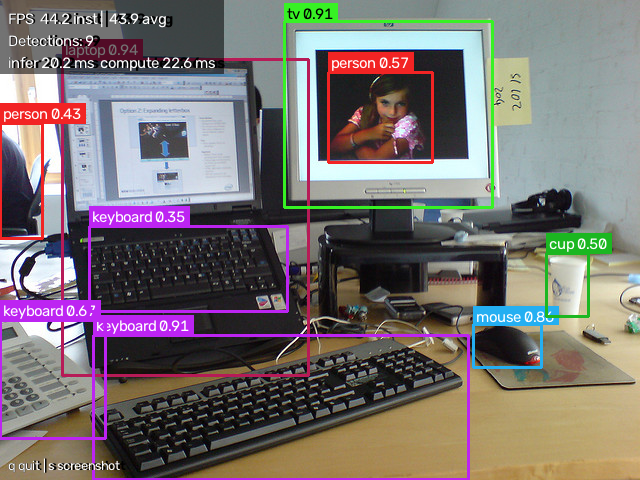

# Real-time object detection

Real-time object detection on a webcam, running on the CPU. It uses YOLOX-Tiny
through ONNX Runtime, detects all 80 COCO classes, draws boxes with confidence
scores, and sustains **38.0 FPS at 416×416 on an Intel i5-1135G7 with no GPU**.
The default model is INT8-quantised, which measured 1.9× faster than FP32 for
2.5 mAP points and is built locally in about 8 seconds during setup. There is no
PyTorch dependency and no CUDA requirement: `pip install -r requirements.txt` is
about 40 MB of wheels and the same command on x86_64 and ARM64. Everything also
runs from a video file or a still image, so it is demonstrable on a machine with
no camera.



*Boxes, class names, two-decimal confidence scores and the live FPS/latency HUD.
This is `assets/sample.jpg`, a CC BY 2.0 image bundled with the repo — reproduce
it with `python -m src.main --source assets/sample.jpg`.*

**New here?** [SUBMISSION.md](SUBMISSION.md) maps the three deliverables to the
files that hold them, with the exact commands to run each one.

**Demo video:** [43 s of live webcam detection, FPS counter visible throughout](https://github.com/Pratik7595/real-time-object-detection/releases/download/v1.0/demo.mp4)
(MP4, 4.3 MB, hosted as a release asset).

Produced by the tool's own `--record` flag rather than by screen-capture
software, so the frame rate shown in the clip is the frame rate that was
actually measured. Shot list and recording commands:
[docs/DEMO_SHOTLIST.md](docs/DEMO_SHOTLIST.md).

---

## Features

- **INT8 by default.** Quantisation is a measured 1.9× on this CPU, not a
  guess — the FP32 model is one flag away if you want the accuracy back.
- **Threaded capture with a drop-stale buffer.** The capture thread keeps only
  the newest frame. If inference falls behind, frames are dropped rather than
  queued, so display latency stays bounded instead of drifting further behind
  reality every second. Measured cost of the capture stage while the camera was
  outrunning the detector: **0.11 ms**.
- **All 80 COCO classes**, with a `--classes` filter that accepts names or
  indices.
- **Confidence on every box**, to two decimals, on a filled chip whose text
  flips between black and white so it stays readable against bright and dark
  scenes alike.
- **Live HUD** showing instantaneous FPS, rolling-average FPS, detection count
  and inference latency.
- **Per-stage instrumentation** (capture / preprocess / inference / postprocess /
  render) with a per-run CSV written to `results/`.
- **`--record`** writes an annotated MP4 at a *measured* frame rate, so the clip
  plays back at real speed instead of being silently sped up or slowed down.
- **Any source:** webcam index, video file, or still image. `--source 0`,
  `--source clip.mp4`, `--source assets/sample.jpg`.
- **Checksummed weight download.** Weights are not committed; the download
  script verifies a pinned SHA-256.
- **Honest measurement.** Every number in this README comes from a script in
  this repository, and each one names the command that produces it.

## Install

Requires **Python 3.9+** (developed and measured on 3.12.10). No GPU, no CUDA,
no compiler.

<details open>
<summary><b>Windows</b></summary>

```bash
git clone https://github.com/Pratik7595/real-time-object-detection.git
cd real-time-object-detection
python -m venv .venv
.venv\Scripts\activate
pip install -r requirements.txt
python models/download_weights.py
```
</details>

<details>
<summary><b>macOS</b></summary>

```bash
git clone https://github.com/Pratik7595/real-time-object-detection.git
cd real-time-object-detection
python3 -m venv .venv
source .venv/bin/activate
pip install -r requirements.txt
python models/download_weights.py
```

On first run macOS will ask for camera permission for your terminal app. If you
never see the prompt, see Troubleshooting.
</details>

<details>
<summary><b>Linux</b></summary>

```bash
git clone https://github.com/Pratik7595/real-time-object-detection.git
cd real-time-object-detection
python3 -m venv .venv
source .venv/bin/activate
pip install -r requirements.txt
python models/download_weights.py
```

If OpenCV complains about a missing `libGL.so.1`, install it:
`sudo apt install -y libgl1 libglib2.0-0`.
</details>

`download_weights.py` does two things: it fetches the FP32 weights (20 MB,
SHA-256 verified) and then builds the INT8 model that `config/config.yaml`
points at. The quantisation step takes about 8 seconds, needs no network, and
calibrates on the 24 images committed in `assets/calib/`. Pass `--no-quantize`
to skip it and run FP32 with `--model models/yolox_tiny.onnx`.

Then, on any platform:

```bash
python -m src.main --source 0
```

Press `q` to quit, `s` to save a screenshot to `results/`.

**No camera?** Everything works from a file, and the repo ships a sample image:

```bash
python -m src.main --source assets/sample.jpg
```

## Usage

```bash
# Live webcam (default). Try --source 1 if you have more than one camera.
python -m src.main --source 0

# A video file, or the bundled still image
python -m src.main --source clip.mp4
python -m src.main --source assets/sample.jpg

# Only show certain classes; names or indices both work
python -m src.main --classes person laptop "cell phone"
python -m src.main --classes 0 63 67

# Trade accuracy for speed. Needs the variable-input model built once:
#   python models/make_dynamic.py --src models/yolox_tiny_int8.onnx
python -m src.main --model models/yolox_tiny_int8_dynamic.onnx --imgsz 320

# Twice the frame rate by detecting on every other frame.
# The HUD marks boxes as reused while this is on.
python -m src.main --infer-every 2

# Be stricter about what counts as a detection
python -m src.main --conf 0.45 --iou 0.5

# Record an annotated MP4 (this is how the demo video is made)
python -m src.main --source 0 --record results/demo.mp4

# Headless, e.g. over SSH or in CI
python -m src.main --source assets/sample.jpg --no-display --max-frames 100

# List the 80 class names with their indices
python -m src.main --list-classes
```

Every flag falls back to [`config/config.yaml`](config/config.yaml), which is
commented with the reasoning behind each default.

### Benchmarking and evaluation

```bash
# FPS / latency / CPU / RAM across three network input sizes
python -m src.benchmark

# Before-and-after table for each optimisation
python -m src.benchmark --ablation

# ONNX Runtime thread scaling
python -m src.benchmark --threads-sweep

# Capture-resolution sweep (needs a real camera)
python -m src.benchmark --capture-sweep --source 0
```

Each run writes a timestamped CSV and Markdown pair to `results/`; the curated
tables are committed there too, including
[`results/benchmark_capture.md`](results/benchmark_capture.md) for the capture
sweep. Read that one with its caveats: every row is pinned at the webcam's own
frame rate rather than the detector's, and the camera under test silently
substitutes 640x480 for the 960x540 it does not support. Both are written up in
[§3.1.1 of the performance analysis](docs/PERFORMANCE_ANALYSIS.md).

```bash
# Accuracy on labelled data: ~50 MB of images + a one-time 241 MB annotation download
pip install -r requirements-dev.txt
python scripts/download_coco_subset.py --images 300
python -m src.evaluate
```

### Switching models

```bash
# FP32 instead of the default INT8: +2.5 mAP@0.5:0.95, roughly half the speed
python -m src.main --model models/yolox_tiny.onnx

# Rebuild the INT8 model by hand (download_weights.py already did this)
python models/quantize.py

# Variable-resolution copy, needed for --imgsz other than 416.
# benchmark.py builds this on demand; you only need it for src.main.
python models/make_dynamic.py --src models/yolox_tiny_int8.onnx
```

## Sample input and output

One input and its two outputs are committed, so you can see exactly what this
program produces without installing anything — and diff your own run against a
known-good result.

| | File | What it is |
|---|---|---|
| **Input** | [`assets/sample.jpg`](assets/sample.jpg) | 640×480 desk scene (COCO val2017 #340894, CC BY 2.0) |
| **Output** | [`results/sample_detection.png`](results/sample_detection.png) | The annotated frame: boxes, class names, confidences, HUD |
| **Output** | [`results/sample_output.json`](results/sample_output.json) | The same detections as structured data, plus model and timing metadata |

Reproduce both:

```bash
python scripts/make_sample_output.py
```

Expected result — 9 objects at the default `conf=0.30`:

```
laptop 0.94 | keyboard 0.91 | tv 0.91 | mouse 0.86 | keyboard 0.67
person 0.57 | cup 0.50 | person 0.43 | keyboard 0.35
```

Your confidences may differ in the last decimal place: the INT8 model is built
on your machine, and quantisation is not guaranteed bit-identical across ONNX
Runtime versions. The set of objects found should match.

## Model choice

**YOLOX-Tiny, ONNX, 416×416.** The full comparison is in
[docs/PRD.md](docs/PRD.md); the short version:

| Model | Published mAP@0.5:0.95 | Licence | Runtime dependency |
|---|---|---|---|
| **YOLOX-Tiny** | **32.8** | **Apache-2.0** | onnxruntime, ~16 MB |
| YOLOv8n | 37.3 | **AGPL-3.0** | ultralytics + torch, ~250 MB+ |
| YOLOv5n | 28.0 | **AGPL-3.0** | torch |
| MobileNet-SSD v2 | ~22 | Apache-2.0 | OpenCV DNN only |

Three reasons, in order of weight:

1. **Licence.** YOLOv8 and YOLOv5 weights from Ultralytics are AGPL-3.0 — strong
   copyleft, not permissive, and using them would arguably pull this whole
   repository under AGPL. YOLOX is Apache-2.0. This ruled out the two models
   most people reach for first.
2. **Dependency weight.** Megvii publish a pre-exported `.onnx`, so there is no
   PyTorch in the tree at all. That is the difference between a ~40 MB install
   and a ~300 MB one, and it is why a reviewer can go from clone to live
   detection inside five minutes.
3. **Accuracy per millisecond.** 32.8 mAP at a 416 input beats YOLOv5n's 28.0 at
   640. MobileNet-SSD is faster still but ~22 mAP at 300×300 misses small and
   mid-distance objects badly enough to be visible in a live demo.

The cost of this choice is that ONNX Runtime returns raw tensors, so
letterboxing, grid decode and NMS are implemented here in NumPy
([`src/detector.py`](src/detector.py)) rather than being handed over by a
framework.

**Model licence: Apache-2.0, © Megvii Inc.** Weights are downloaded from the
[YOLOX 0.1.1rc0 release](https://github.com/Megvii-BaseDetection/YOLOX/releases/tag/0.1.1rc0)
and verified against a pinned SHA-256. See [NOTICE](NOTICE) for full attribution.

**On the INT8 default.** Quantisation is static, calibrated on 24 images in
`assets/calib/`. Those images are deliberately drawn from *outside* the 300
images used for evaluation — calibrating on the data you later score against
inflates the result. (An earlier build of this project made exactly that
mistake; the corrected figure differs by 0.0004 mAP, but the method matters more
than the size of the error.) There is no checksum for the INT8 file because it
is built locally, and the build is not guaranteed bit-identical across ONNX
Runtime versions.

## Performance

Measured on Intel i5-1135G7 (4C/8T, 15 W), 8 GB RAM, Windows 11, **CPU only, no
GPU**. 300 frames per configuration after a 30-frame warm-up and a 25-second
thermal settle. Reproduce with `python -m src.benchmark`.

INT8, the shipped default:

| Model input | Device | FPS mean | FPS median | FPS p95 | Inference ms | Frame ms | Peak RSS |
|---|---|---|---|---|---|---|---|
| 320×320 | CPU | 53.7 | 54.4 | 66.3 | 16.3 | 18.6 | 105 MB |
| **416×416** (default) | CPU | **38.0** | 38.4 | 46.0 | 22.9 | 26.3 | 112 MB |
| 512×512 | CPU | 27.6 | 27.9 | 32.7 | 31.6 | 36.2 | 121 MB |

FP32, for comparison — same command with `--model models/yolox_tiny.onnx`:

| Model input | FPS mean | Inference ms | Peak RSS |
|---|---|---|---|
| 320×320 | 32.4 | 28.8 | 129 MB |
| 416×416 | 19.8 | 47.1 | 142 MB |
| 512×512 | 13.2 | 71.8 | 166 MB |

**The >15 FPS requirement is met at every INT8 resolution**, with 2.5× headroom
at the default. FP32 clears it at 320 and 416 but misses at 512 (13.2).

Where the time goes at 416 INT8 — **inference is still 87% of the frame**:

| capture | preprocess | inference | postprocess | render |
|---|---|---|---|---|
| 0.03 ms | 1.22 ms | 22.85 ms | 1.71 ms | 0.46 ms |

Accuracy, on **COCO val2017, first 300 labelled images — not webcam footage**:

| Metric | INT8 (default) | FP32 |
|---|---|---|
| mAP@0.5 | 0.5183 | **0.5326** |
| mAP@0.5:0.95 | 0.3315 | **0.3568** |
| Precision / Recall / F1 @ conf 0.30 | 0.673 / 0.483 / 0.562 | 0.694 / 0.490 / 0.574 |

**The trade: INT8 costs 2.5 mAP@0.5:0.95 points (7.1% relative) and buys 1.9×
the frame rate at 416.** That is the reason it is the default; use
`--model models/yolox_tiny.onnx` if you would rather have the accuracy.

Two caveats worth reading before trusting any FPS number from a laptop:

- **This machine throttles.** Four identical back-to-back runs measured 24.3,
  21.0, 20.4 and 19.4 FPS with nothing changed but time. All figures above are
  the sustained ones, taken after a deliberate thermal settle.
- **Live FPS is capped by your camera, not by the detector.** Now that inference
  costs ~23 ms, this webcam is the bottleneck: measured on its own with no
  inference at all, it delivers **15.0 fps** in the light it had that evening
  (and ~30 fps earlier in the day). A live run therefore tells you about your
  camera and your lighting as much as about this code, which is why
  `benchmark.py` defaults to a deterministic file source.

Full detail, the per-optimisation before/after table, the per-class
precision/recall breakdown and the limitations are in
**[docs/PERFORMANCE_ANALYSIS.md](docs/PERFORMANCE_ANALYSIS.md)**.

## Supported classes

All **80 COCO classes** are detected. `python -m src.main --list-classes` prints
them with indices.

**Verified against ground truth.** The following 20 classes were confirmed
detecting on the 300-image labelled COCO subset, with the true-positive count at
`conf=0.30`, `IoU=0.50` from `python -m src.evaluate` **using the shipped INT8
model**. Full 60-row table in
[`results/accuracy_int8.csv`](results/accuracy_int8.csv) (FP32 equivalent in
[`results/accuracy_fp32.csv`](results/accuracy_fp32.csv)):

| Class | TP | | Class | TP | | Class | TP | | Class | TP |
|---|---|---|---|---|---|---|---|---|---|---|
| person | 430 | | chair | 43 | | car | 37 | | cup | 28 |
| dining table | 26 | | bowl | 20 | | bottle | 19 | | laptop | 15 |
| bus | 15 | | pizza | 14 | | zebra | 13 | | wine glass | 13 |
| tv | 13 | | motorcycle | 13 | | book | 12 | | tie | 11 |
| horse | 11 | | elephant | 11 | | couch | 11 | | suitcase | 10 |

**Live camera observations, stated separately.** In live testing the only class
present in front of the camera was `person` — 411 detections across 400
processed frames, peak confidence 0.94. That is an observation about one class
in one room, not an accuracy measurement, and there is no ground truth behind
it. I am not claiming live verification of the other 19: those objects simply
were not in front of the camera. [docs/DEMO_SHOTLIST.md](docs/DEMO_SHOTLIST.md) is a
checklist of objects to hold up while recording the demo, which is the honest
way to demonstrate the rest.

## Project structure

```
real-time-object-detection/
├── src/
│   ├── main.py             CLI entry point and the main loop
│   ├── detector.py         ORT session, letterbox, grid decode, NMS
│   ├── video_stream.py     Threaded capture with a drop-stale buffer
│   ├── visualizer.py       Boxes, labels, confidence, HUD
│   ├── metrics.py          Per-stage timers, rolling FPS, CSV output
│   ├── config.py           YAML + CLI override merge, validation
│   ├── benchmark.py        FPS / latency / CPU / RAM sweeps
│   ├── evaluate.py         mAP and per-class P/R/F1 on labelled data
│   └── coco_classes.py     Class names and the 80 -> 91 id mapping
├── config/config.yaml      Every default, with the reasoning
├── models/
│   ├── download_weights.py Checksummed weight download
│   ├── make_dynamic.py     Relax the fixed 416 input
│   └── quantize.py         Optional INT8
├── scripts/
│   ├── download_coco_subset.py
│   └── build_calibration_set.py
├── tests/                  130 tests, no GPU or camera required
├── assets/
│   ├── sample.jpg          CC BY 2.0, bundled for demos and tests
│   └── calib/              24 CC BY 2.0 images for INT8 calibration
├── results/                Committed measurement output
└── docs/
    ├── PRD.md              Design decisions and the model comparison
    ├── PERFORMANCE_ANALYSIS.md
    └── DEMO_SHOTLIST.md
```

`metrics.py` and `config.py` are not in the original brief's layout. They exist
because timing and config are shared by `main`, `benchmark` and `evaluate`, and
when timing lived inside the main loop the benchmark re-implemented it and the
two FPS numbers quietly disagreed.

## Platform support

Pure pip wheels, no platform-specific binaries, `pathlib` throughout, no shell
calls. Capture backend selection adapts to the OS (DirectShow/MSMF on Windows,
AVFoundation on macOS, V4L2 on Linux) and always falls back to `cv2.CAP_ANY`.

| Platform | Status |
|---|---|
| Windows 11 x86_64 | **Verified** — all measurements in this repo |
| Linux x86_64 | Wheels available for every dependency; not run by me |
| macOS arm64 (Apple Silicon) | Wheels available for every dependency; not run by me |
| Linux aarch64 (64-bit Pi OS, Jetson) | Wheels available for every dependency; not run by me |
| Windows on ARM | onnxruntime publishes recent ARM64 wheels; not run by me |
| 32-bit Raspberry Pi OS | No `opencv-python` wheel — use `sudo apt install python3-opencv` |

I have one x86_64 Windows laptop, so anything other than the first row is "the
wheels exist", not "I ran it". Expect roughly 3–6× lower frame rates on a
Raspberry Pi 4; the INT8 default already helps there, and `--imgsz 320` is the
next lever.

## Testing

```bash
pip install -r requirements-dev.txt
python -m pytest
```

130 tests, ~6 seconds, no camera and no GPU needed. They cover NMS geometry
(including that per-class suppression keeps a person standing in front of a TV),
detector output shape and bounds, config validation and CLI precedence, file and
image sources, error paths for missing/corrupt files, benchmark argument
validation and table rendering, the accuracy pipeline's COCO id translation and
per-class matching, and end-to-end inference on the bundled sample.
Tests needing weights skip with instructions rather than fail if you have not
run `download_weights.py`.

One test is worth calling out: `test_normalisation_would_break_the_model` asserts
that feeding the model `/255`-normalised input produces **zero** detections. The
YOLOX export takes raw 0–255 BGR, and getting that wrong fails silently — no
error, no warning, just an empty list. That test is the tripwire.

## Troubleshooting

**"Could not read from camera index 0"**
Another application is usually holding the camera — Teams, Zoom, Slack, or the
Windows Camera app. Close it and retry. If you have more than one camera, try
`--source 1`, `--source 2`. The error message lists every backend that was tried.
To carry on without a camera at all: `--source assets/sample.jpg`.

**Camera permissions**
- *Windows:* Settings → Privacy & security → Camera → allow desktop apps.
- *macOS:* System Settings → Privacy & Security → Camera, and tick your terminal
  (or IDE). macOS only prompts once; if you dismissed it you must enable it here
  by hand.
- *Linux:* your user needs to be in the `video` group —
  `sudo usermod -aG video $USER`, then log out and back in.

**"opened but produced no frame within 6s"**
The device opened but delivered nothing. Almost always another app holding it,
or a virtual camera driver (OBS, ManyCam) that is installed but not running.

**Low FPS**
First, check whether it is actually the detector. If the HUD's `capture` time is
large, you are camera-bound and nothing in this list will help — a webcam in dim
light commonly halves its own frame rate. Add light, or measure the detector on
its own with `python -m src.benchmark`.

If it really is inference:
1. Confirm you are on the INT8 model. `python -m src.main` prints the model name
   at startup; it should say `yolox_tiny_int8.onnx`. If it says
   `yolox_tiny.onnx` you are running FP32 at roughly half the speed.
2. `--imgsz 320` — measured 53.7 FPS versus 38.0 at 416 (needs
   `python models/make_dynamic.py --src models/yolox_tiny_int8.onnx` once).
3. `--infer-every 2` — roughly doubles throughput by detecting on every other
   frame. The HUD marks boxes as reused while this is on.
4. `python models/download_weights.py --model nano` for a much smaller model
   (published 25.8 mAP against 32.8).

Also check nothing else is using the CPU. A benchmark run against a background
compile measured 15.3 FPS where an idle machine measured 25.6 — I did this to
myself while building this project and had to throw the numbers away.

**`--imgsz` other than 416 fails**
The released YOLOX export has a hard-coded 416×416 input, and quantising it
preserves that. Run `python models/make_dynamic.py --src models/yolox_tiny_int8.onnx`
once, then `--model models/yolox_tiny_int8_dynamic.onnx`. The error message says
so too. `benchmark.py` handles this on its own.

**"Model weights not found ... yolox_tiny_int8.onnx"**
The default model is built locally rather than downloaded, so a clone that only
fetched weights with `--no-quantize` will not have it. Either
`python models/quantize.py`, or run FP32 with
`--model models/yolox_tiny.onnx`.

**`pip install pycocotools` fails**
Only needed for `src/evaluate.py`, which is why it is in `requirements-dev.txt`
and not `requirements.txt`. On Windows, version 2.0.11 ships a cp312 wheel and
needs no compiler. If pip falls back to a source build, either install the
Visual C++ Build Tools or skip evaluation — nothing else in the project imports
it.

**`libGL.so.1: cannot open shared object file` (Linux)**
`sudo apt install -y libgl1 libglib2.0-0`.

## Developing with Claude Code: Agent View

I'm using and exploring [Claude Code](https://code.claude.com/docs)'s
**Agent View** while working on this project. This section explains what it is,
how I use it on this repository, and why it helps. Nothing here is needed to
*run* the detector. It is about how the code gets written.

> **Status:** Agent View is a **research preview** (Claude Code 2.1.x at the
> time of writing, available on Pro, Max, Team, Enterprise and Claude API
> plans). Commands and shortcuts may change, so the
> [official Agent View docs](https://code.claude.com/docs/en/agent-view) are the
> source of truth.

### What it is

Normally a Claude Code session belongs to one terminal: you give it a task,
watch it work, answer its questions, and then give it the next one. Agent View
separates the work from the terminal. You send several tasks to run as
**background sessions**, and one screen shows all of them:

```bash
claude agents
```

Each row is one session, with a short, continually updated summary: what a
working session is doing, the question a blocked session is asking, or the
result a finished session produced. The rows are grouped by state:

| State | Meaning |
|---|---|
| **Working** | Claude is running tools or writing a reply |
| **Needs input** | Waiting on you: a permission prompt, a question, a choice |
| **Idle** | Finished its turn and ready for a follow-up prompt |
| **Completed / Failed / Stopped** | Ended successfully, ended with an error, or stopped by you |

Sessions that need you **move to the top automatically**, so you don't have to
check each one to find out which is waiting.

The sessions are run by a per-user **supervisor process**, separate from your
terminal. You can close Agent View, or the terminal, and the work continues.
Open `claude agents` again later and the sessions are still listed.

### Starting background sessions

There are three ways in, depending on where you are:

```bash
# 1. From the shell: start a task directly in the background
claude --bg "run the test suite and fix anything that fails"
claude --bg --name "nms-review" "review src/detector.py's NMS for edge cases"

# 2. From Agent View: type a prompt in the input box and press Enter.
#    Every prompt starts a new, independent session.

# 3. From inside an ordinary interactive session:
/bg                 # send this conversation to the background
/bg <prompt>        # ...with a new instruction first
```

In a foreground session, pressing `←` on an empty prompt backgrounds that
session and opens Agent View, so you can switch without leaving the terminal.

### Checking on sessions: peek and attach

There are two ways to look at a session:

- **Peek** (`Space`) opens a side panel showing the session's latest output or
  question. You can type a reply and press `Enter`, or press a number key for a
  multiple-choice question, without leaving the list.
- **Attach** (`Enter` or `→`) opens the full interactive session. Claude posts a
  recap of what happened while you were away. Press `←` on an empty prompt (or
  `/exit`) to detach again. **Detaching never stops the session.**

Most-used keys in Agent View:

| Key | Action |
|---|---|
| `↑` / `↓` | Move between sessions |
| `Space` | Peek at the selected session |
| `Enter` / `→` | Attach (or dispatch, if the input box has text) |
| `Ctrl+Enter` | Dispatch and attach immediately |
| `Ctrl+R` | Rename a session |
| `Ctrl+S` | Group by state or by directory |
| `Ctrl+X` | Stop a session (press again within 2 s to delete it) |
| `?` | Show every shortcut |

Typing in the input box also filters the list: `s:blocked` shows everything
waiting on you, and `s:working` shows what is still running.

From a plain shell, the same sessions can be scripted:

```bash
claude agents --json        # machine-readable session list
claude logs <id>            # recent output of one session
claude attach <id>          # attach from this terminal
claude stop <id>            # stop a session
```

### Parallel work stays isolated: git worktrees

This makes it safe to run several sessions against one repository. **Before a
background session edits a file, it moves into its own
[git worktree](https://code.claude.com/docs/en/worktrees)** under
`.claude/worktrees/`, on its own branch. Two sessions editing `src/detector.py`
at the same time are working on two separate copies, so neither overwrites the
other or your own working copy. When the session finishes, it commits its work
and (when there is a remote) pushes the branch. For code tasks it can open a
draft PR. It never force-pushes and never merges into `main`.

`.claude/worktrees/` is listed in this repo's `.gitignore` for that reason.

### How I use it on this repository

Much of the work on this project splits into independent tasks, which suits
Agent View well:

| Background session | Why it runs well unattended |
|---|---|
| `"run python -m pytest and fix any failure"` | 130 tests, ~6 s, no camera or GPU, so Claude can check its own fix |
| `"review src/video_stream.py's stall handling against CLAUDE.md"` | Read-only review; the result is waiting when I come back |
| `"check every number in docs/ against the committed results/ tables"` | Long and tedious by hand, and easy to verify afterwards |
| `"add a test for --classes with an unknown class name"` | Small, self-contained, and ends on a runnable test |

Each session reads [`CLAUDE.md`](CLAUDE.md) at startup, so every one of them
gets the same project rules: raw 0–255 BGR input, the two-thread capture design,
the two COCO id spaces, and the measurement discipline. I don't have to repeat
them in each prompt.

**One rule to follow here: never run benchmarks in parallel with other
sessions.** Every FPS number in this README assumes an otherwise idle CPU, and
a benchmark next to a background compile once measured 15.3 FPS where an idle
machine measured 25.6 (see [Troubleshooting](#troubleshooting)). Several agents
running tests at once cause exactly that kind of contention. Run
`python -m src.benchmark` **on its own**, after the other sessions have
finished or been stopped. Tests, reviews and documentation are fine in
parallel; timing measurements are not.

### Benefits

- **Parallelism without juggling terminals.** Several tasks run at once, and one
  screen shows all of them, instead of a tab per session that you have to
  remember to check.
- **You're only interrupted when needed.** Sessions that need input rise to the
  top, and working sessions carry on without you. Your attention goes to
  decisions, not to watching progress.
- **Status at a glance.** The per-row summary tells you what each session is
  doing or what it produced without opening the full transcript.
- **Quick replies with peek.** Approving a permission or answering a question
  takes a keystroke from the list, without a full context switch.
- **Work survives the terminal.** The supervisor keeps sessions running after
  you close Agent View, and brings back a session whose process exits
  unexpectedly. Long tasks aren't tied to one terminal window.
- **Safe concurrent edits.** Worktree isolation means parallel sessions can't
  overwrite each other or your uncommitted changes, and each session's result
  lands on a separate branch that you can review.
- **Reviewable output.** Finished work arrives as commits on a branch (or a
  draft PR), so it goes through the same review as any other change rather than
  appearing silently in your working copy.
- **Scriptable.** `claude agents --json` and `claude logs` let you check on
  sessions from the shell or from your own tooling.
- **Consistent context.** Every session loads the same `CLAUDE.md`, so parallel
  agents follow the same project conventions.

### Things to keep in mind

- It is a research preview, so behaviour and shortcuts may change between
  Claude Code releases.
- Parallel sessions compete for CPU, which matters a great deal for a project
  whose main output is an FPS number (see above).
- Deleting a session from Agent View also removes its worktree, including
  uncommitted changes. It refuses if the worktree has unpushed commits, but
  review or push a session's branch before deleting it.
- A finished session that has been left unattended for an hour has its process
  stopped to free resources. The conversation stays on disk and resumes when
  you reply.
- To turn it off: `CLAUDE_CODE_DISABLE_AGENT_VIEW=1`, or
  `"disableAgentView": true` in settings.

Further reading: [Agent View documentation](https://code.claude.com/docs/en/agent-view)
· [Anthropic's announcement](https://claude.com/blog/agent-view-in-claude-code).

## Licence

Code in this repository: **MIT** — see [LICENSE](LICENSE).

Model weights: **Apache-2.0**, © Megvii Inc., from the
[YOLOX](https://github.com/Megvii-BaseDetection/YOLOX) project. Not committed
here; fetched and checksum-verified by `models/download_weights.py`. The INT8
model is derived from them locally and inherits the same licence.

Bundled images: **CC BY 2.0**, from COCO val2017 — `assets/sample.jpg`
(image id 340894) and the 24 calibration images in `assets/calib/`
(ids listed in [NOTICE](NOTICE), per-image records in
`assets/calib/MANIFEST.json`).

Full attribution for all third-party material is in [NOTICE](NOTICE).
