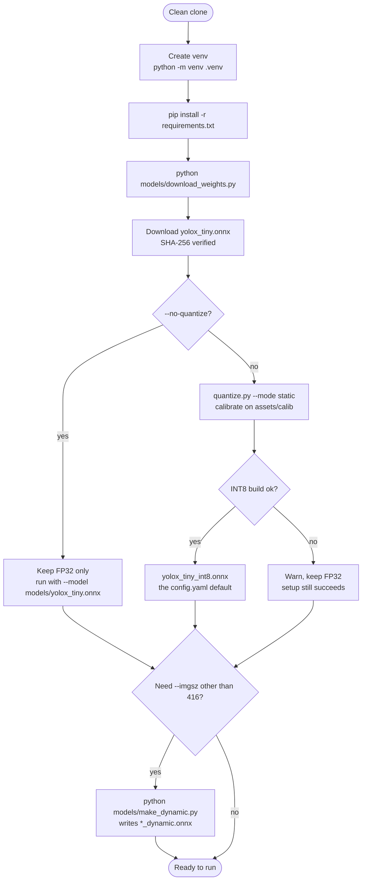
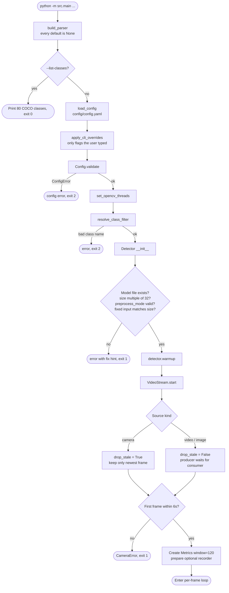
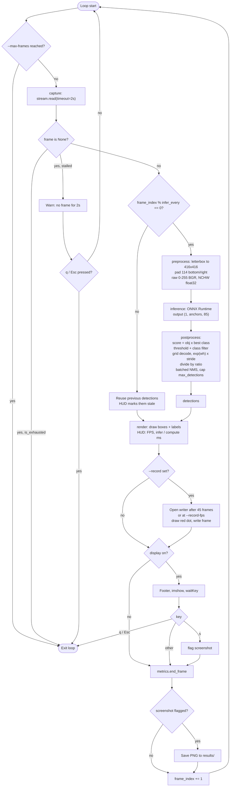
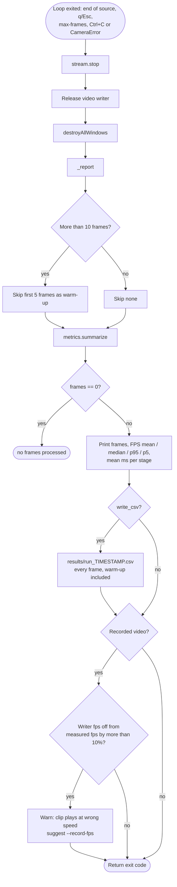

# Workflow List

Step-by-step flowcharts for the live detection app, from a clean clone to the
end-of-run report. Each diagram is followed by numbered notes that point at the
code that implements the step.

1. [Setup](#1-setup)
2. [Startup](#2-startup-srcmainpy)
3. [Per-frame loop](#3-per-frame-loop)
4. [Shutdown and report](#4-shutdown-and-report)

---

## 1. Setup

1. **Environment**: create the venv and install `requirements.txt`. PyTorch and CUDA are not needed.
2. **FP32 weights**: `models/download_weights.py` downloads `yolox_tiny.onnx` and pins it by SHA-256.
3. **INT8 weights**: the same script calls `quantize.py` (static mode) to build `yolox_tiny_int8.onnx` from the 24 images in `assets/calib/`. That calibration set is kept separate from the evaluation subset. If the INT8 build fails, the script warns and does not stop setup, because the FP32 model already works.
4. **Dynamic input (optional)**: the released graph only accepts a fixed 416×416 input. Any other `--imgsz` needs `models/make_dynamic.py` first.

---

## 2. Startup (`src/main.py`)

1. **Parse arguments**: every argparse default is `None`. That lets `apply_cli_overrides` apply only the flags the user actually typed, so values in `config.yaml` are not overwritten by argparse defaults.
2. **Config**: `load_config` reads the YAML and raises on unknown keys. The CLI overrides are applied on top, then `Config.validate` checks thresholds, that the input size is a multiple of 32, and the device, `preprocess_mode` and `infer_every` values.
3. **Class filter**: `--classes person cup ...` is resolved to the model's contiguous 0–79 ids.
4. **Detector**: `Detector.__init__` repeats the checks that `config.py` makes, because the class is public API. It also refuses a fixed-input graph whose size doesn't match and points at `make_dynamic.py`. It then builds the ONNX Runtime session, the decode grids and the reusable buffers.
5. **Warm-up**: a few throwaway inferences so the first real frame isn't the slow one.
6. **Capture thread**: `VideoStream` classifies the source. A camera keeps only the newest frame so latency stays bounded. A video or image file makes the producer wait until each frame is taken, so no frame is skipped. `start()` fails fast if no frame arrives within 6 s.

---

## 3. Per-frame loop

1. **Capture**: `stream.read()` returns the newest frame, or `None` in two cases. If the source ended (`is_exhausted` is true), the loop stops. If no frame arrived within the timeout, the camera has stalled, and the app warns and keeps going. The stall branch skips the rest of the loop body, so it calls `waitKey` itself to keep `q` working.
2. **Frame skipping**: when `--infer-every N` is greater than 1, only every Nth frame runs the model and the frames in between redraw the previous boxes. In that mode only the mean FPS is meaningful.
3. **Preprocess**: an aspect-preserving resize, padded with the value 114 on the bottom and right only. The input stays **raw 0–255 BGR**: no `/255`, no mean/std, no colour conversion. Normalising the input yields zero detections without raising any error, and `tests/test_detector.py::test_normalisation_would_break_the_model` checks for this.
4. **Inference**: a single `session.run` call that returns undecoded predictions. The xy values are grid-cell offsets, wh is in log space, and the objectness and class scores are already passed through a sigmoid.
5. **Postprocess**: rows are scored and thresholded *before* the boxes are decoded, so no decode work is spent on rejected boxes. Boxes are mapped back to the original frame with a single divide by the resize ratio (the padding is bottom/right, so there's no offset). NMS is per class, done in one pass by shifting each class's boxes apart.
6. **Render**: draws the boxes and labels. The HUD shows instant and rolling FPS plus the detector's compute time (preprocess, inference and postprocess, without capture or render).
7. **Record (optional)**: the video writer opens after 45 frames so its frame rate can be measured first, or immediately if `--record-fps` is given.
8. **Keys**: `q` or Esc quits and `s` takes a screenshot. The PNG is written *after* `end_frame()`, so its cost isn't counted in the render timing.
9. **Timing**: every stage runs inside `metrics.stage(...)`. The five stage names are shared with `benchmark.py` and `evaluate.py`.

---

## 4. Shutdown and report

1. **Cleanup** runs in a `finally` block, so the capture thread, the video writer and the window are released however the loop ended.
2. **Warm-up exclusion**: the first 5 frames are left out of the summary but kept in the CSV, so the headline numbers can always be checked against the raw data.
3. **Report**: prints frame count, elapsed time, FPS (mean, median, p95, p5) and the mean time for each stage. The per-run CSV under `results/` is gitignored.
4. **Recording check**: if the writer's frame rate and the measured average differ by more than 10%, the report warns that the clip will play at the wrong speed and suggests `--record-fps`.
